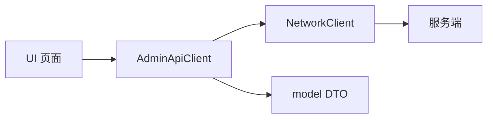

# 管理员客户端设计说明

## 定位

管理员端是面向运营和运维人员的 Qt 6 桌面后台。界面采用与用户端一致的浅色卡片视觉，
强调稳定数字、明确状态、可追溯操作，而不是复杂动画。

## 分层与目录

```text
src/
  app/        应用级依赖装配和登录/主窗口切换
  api/        管理员业务请求唯一入口；认证检查与请求进行中保护
  model/      服务端 JSON 到强类型 DTO 的集中解析和一致性校验
  net/        TCP framing、requestId、超时、断线和迟到响应处理
  protocol/   action、状态枚举、错误码和消息外壳
  session/    管理员登录态唯一来源
  ui/         窗口与独立业务页面
  ui/widgets/ 可复用表格、状态总览等组件
tests/        不依赖真实数据库的协议/业务闭环冒烟测试
tools/        本地联调用 mock server，不进入生产链路
docs/         与成员 1、成员 2 对齐的接口和业务口径
```

该结构参照用户端的 `model/net/protocol/session/ui/tests/tools` 分层，但管理员端
不复制用户端实现，也不跨分支修改用户代码。

## 数据与依赖方向



`ApplicationController` 统一创建并注入 `NetworkClient`、`AdminSession`、
`AdminApiClient` 和窗口，业务页面不自行创建这些共享依赖。

- 页面不直接构造协议 JSON，也不直接操作 socket。
- 模型负责字段类型与跨字段约束；解析失败时 UI 不展示部分脏数据。
- `AdminSession` 是登录态唯一来源；密码不持久化。
- `MainWindow` 负责导航框架。新增完整业务优先使用独立页面类，不继续堆叠到
  `MainWindow.cpp`。

## 表格与管理操作

- `EntityTableView` 使用 `QSortFilterProxyModel` 提供排序。
- 真实实体 ID 存在源模型 `Qt::UserRole + 1`，任何按钮操作都先把视图索引映射
  回源模型，禁止把视图行号或显示编号当数据库 ID。
- 表格显示值与排序值分离。功率、累计次数、累计时长按原始数值排序，不按带
  单位的显示字符串排序。
- 充电桩页的电站选项来自本次服务端列表，并在下拉框中保存 `stationId`；编号/
  站名关键词、站点、类型、状态可以组合筛选。筛选仅改变当前完整结果集的视图，
  不修改 DTO、服务端状态或实体 ID。
- 写操作必须经过二次确认，等待服务端结果后提示；客户端不提前插入、删除或
  修改业务行。
- 写操作成功后重新查询服务端，保证列表和数据库一致。
- 每类请求维护单独的进行中标志，避免双击或重复并发。
- 站点列表同样把 `stationId` 存入实体角色；站内详情只通过该 ID 调用
  `station.detail`，不会从站名或视图行号反推主键。
- 站点新增表单只提交协议字段，不提前构造本地站点或初始桩。服务端成功返回后，
  页面重新查询站点列表，再按新 `stationId` 查询详情。
- 站点详情允许多个请求在网络层并发；页面使用递增 generation 忽略较早选择的
  迟到响应，避免快速切换站点时旧数据覆盖当前详情。
- 站点编辑只提交名称、地址、经纬度和站点级电价，并携带列表返回的 `version`；服务端使用
  乐观锁拒绝旧版本，客户端冲突后重新查询，不悄悄覆盖其他管理员的修改。
- 总桩数与在线率是服务端派生字段，不出现在编辑表单；站点 ID 永远不可变。
- 设备状态调整携带 `expectedStatus` 和必填原因。目标只允许空闲、故障、离线，
  “在用”完全由预约与订单状态机驱动；服务端仍需在事务内检查活动订单。
- 在用设备的“调整状态”入口保持可点击，以弹窗解释订单保护规则；该分支在 UI
  层立即结束，不构造请求。安全边界仍由服务端的活动订单检查兜底。
- 状态操作成功后站点页同时重查详情和列表，使设备行与在线率最终一致；全局页面
  在 Commit 7 统一跨页刷新前仍以进入页面或显式刷新为准。
- 当前不实现站点硬删除。删除牵涉设备、订单、账单和统计历史，必须由成员 A 先
  冻结停用/软删除规则与跨端可见性，客户端不能自行设计级联删除。
- 用户查询由服务端按手机号关键字、状态和分页参数执行；客户端不对当前页做“全库
  搜索”。空关键字表示全部，输入过程不自动逐字发包。
- 账号状态与业务状态是两个正交维度：前者为正常/冻结，后者复用订单状态
  `IDLE / RESERVED / CHARGING / WAIT_SETTLEMENT`。页面同时展示关联站点和桩，
  不用桩的“在用”状态反推具体用户。
- `WAIT_SETTLEMENT` 的界面文案与用户端统一为“待支付”，表示物理充电已经停止，
  账单已确定但尚未扣款完结；它仍属于未完成订单，但不能据此断言桩仍在充电。
- 活跃订单摘要由管理员用户列表返回，禁止管理端调用用户专属 `order.active` 或伪造
  用户会话。服务端应批量关联查询并返回一致快照，避免 N+1 和半行旧数据。
- 用户表与其他实体表相同，把 `userId` 保存在实体角色中；排序、翻页后所有状态
  操作都从当前选择重新解析 ID，禁止依赖行号。
- 冻结/解冻携带 `expectedStatus` 与审计原因，收到成功响应后也不直接改 DTO，而是
  重新查询当前条件。服务端拒绝时同样刷新，以处理并发状态变化。
- 活跃订单策略属于服务端状态机：客户端不拉订单猜测是否可冻结，只展示服务端
  `code/message`。Mock 的拒绝样例只验证此边界，不定义生产策略。
- 冻结确认采用两阶段交互：先展示订单阶段、订单号、站点、桩和风险，再填写审计
  原因。服务端拒绝使用高对比自定义结果框展示，不依赖平台默认消息框配色。
- 服务端仍须事务内复查。当前客户端/Mock 推荐活跃订单返回 `2003`；成员 A 若冻结
  其他策略，必须同步停止、结算和旧会话语义。
- Mock 根据 `activeOrder` 是否存在统一保护三种未完成订单，不按用户 ID 或单个状态
  特判；测试分别覆盖 `CHARGING` 与 `WAIT_SETTLEMENT`。
- 用户时间字段兼容 A 当前 Repository 的 epoch 毫秒与权威文档的 ISO 8601，内部
  统一后本地化显示；线格式需由 A 的 Commit 6 最终冻结。
- 营收页面使用独立 `RevenueStatisticsPage`，汇总和趋势都只经过
  `AdminApiClient`；DTO 严格校验金额、币种、时区、日桶数量与连续日期，任一字段
  异常时不展示部分结果。
- `admin.revenue.summary` 与 `admin.revenue.trend` action 名复用成员 A 权威文档；
  当前字段是等待 A 最终冻结的客户端联调契约。营收只接受服务端对 `FINISHED`
  订单按 `settleTime` 的聚合，客户端不查询订单或自行定义 SQL 口径。
- 7/30 日趋势允许同时在途，并由页面 generation 丢弃旧选择的迟到响应；汇总请求
  则保持单请求保护。请求失败会清空对应视图，避免把旧数据标成最新数据。
- 趋势图使用 Qt Widgets `QPainter` 自绘折线、面积、坐标和悬停提示，不增加
  `Qt6::Charts` 部署依赖；数据和状态行为与 QChart 折线图要求一致。
- 运营总览使用独立 `OperationsOverviewPage`，`MainWindow` 只负责导航。页面不创建
  新统计口径，而是并发聚合已经存在的接口：营收汇总、7 日趋势、站点完整列表、
  桩状态汇总、桩完整列表以及用户服务端分页总数。
- 首页与营收页会分别按进入页面的时机请求同一营收 action。它们不共享 UI 缓存，
  但共享同一强类型 DTO 和服务端口径，因此错误、过期或缺字段时各自清空，不拿另一
  页旧值填充当前页。
- 首页 7 日曲线与营收页复用同一个 `RevenueTrendChart` 和
  `admin.revenue.trend(days=7)`；营收页继续提供 7/30 日切换。首页不从订单列表计算。
- 站点总数来自 `admin.stations.list` 数组长度；平台用户总数来自
  `admin.users.list(activityFilter=ALL)` 的服务端 `total`；活跃业务人数及前三条
  订单/设备摘要来自同一 action 使用 `activityFilter=ACTIVE,pageSize=3` 的响应，
  两次用户请求按顺序执行以遵守单请求保护。
- 故障关注列表来自当前协议定义为完整结果集的 `admin.chargers.list`，仅筛选
  `status=2` 并显示编号和站点。若 A 后续把该 action 改为分页，必须增加服务端状态
  查询或统计字段，客户端不能把“当前页故障数”标成平台总数。
- 运营关注位于两列宽的窄卡片中，不使用带最小列宽的实体表格。活跃业务和故障设备
  均采用“关键状态 + 关联对象”的双行摘要项，超出高度时只纵向滚动，完整文本同时
  写入工具提示，避免手机号、站点或设备编号相互遮挡。
- 参考看板中的“今日订单数”和“站点营收排行”当前没有成员 A 冻结的统计字段，暂不
  伪造。后续只有在 A 明确订单计数状态/时间字段及站点营收归属规则后才能展示。

## 视觉规则

| 语义 | 颜色 | 用途 |
|---|---|---|
| 主操作/信息 | `#246BFD` / `#1769E8` | 主按钮、选中、链接、充电中 |
| 成功/空闲 | `#14865A` | 在线、空闲、成功 |
| 等待 | `#A66C00` | 待支付、加载、确认前提示 |
| 故障/危险 | `#C43742` | 故障、失败、冻结等危险操作 |
| 离线/次要 | `#718399` | 离线和辅助信息 |

- 页面底色为 `#F3F6F8`，卡片为白色，正文为 `#10233F`；桌面侧栏和原有页面
  层级不变，只统一用户端的浅色产品语言与圆角间距。

- 状态同时显示文字，不只依赖颜色。
- 故障桩采用红色状态标签、浅红整行背景和“需处理”文字，确保选中前后都可辨；
  空闲、在用、离线分别采用绿、蓝、灰语义色。
- 列表同步后按服务端返回状态显示故障待处理数量；该入口只负责快速设置“故障”
  筛选，不会在客户端确认、消除或改写故障。
- 数字使用稳定的大字号层级；表格保持单行选择和只读。
- 加载、空数据、错误都必须有明确状态，错误提供重试入口。
- 站点页采用“台账列表 + 站内设备”上下分区，在线率按绿、蓝、黄、红语义色
  辅助识别，但始终同时显示数值；颜色不参与业务判断。

## Mock 与真实服务端边界

- Mock 仅验证客户端协议、状态和交互，不代表数据库真实数据。
- 真实列表、累计次数、累计时长、状态变化和重启权限都由成员 1 的服务端决定。
- 每次新增 action 必须同步更新 `docs/admin-protocol.md`、Mock、冒烟测试和
  README，直到服务端协议冻结后再移除对应假设。
- 公共 `station.detail` 严格采用成员 A 已实现的响应：站内桩字段为
  `code/powerKw`，`pricePerKwh` 位于站点级，并校验 `availableCount/totalCount`。
- 管理员资源 action 采用成员 A 文档中的复数形式 `admin.chargers.*` 和
  `admin.stations.*`。`admin.stations.update`、`admin.chargers.status.update`
  及其并发错误码属于客户端提出、等待成员 A 纳入权威文档的扩展。
- `admin.users.list`、`admin.users.freeze` 名称和用户状态枚举来自成员 A；分页字段、
  `expectedStatus/reason`、返回字段及 `2104` 仍是等待成员 A 纳入权威文档的扩展。
