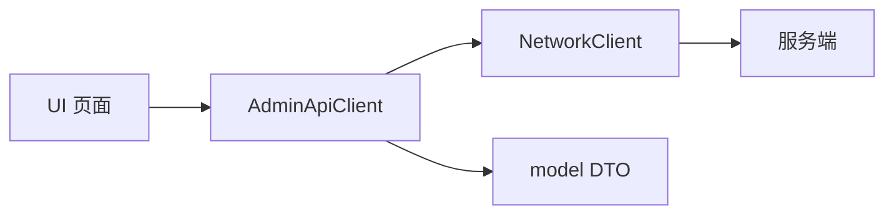

# 管理员客户端设计说明

## 定位

管理员端是面向运营和运维人员的 Qt 6 桌面后台。界面延续深色 EV 运营中心视觉，
强调稳定数字、明确状态、可追溯操作，而不是复杂动画。

## 分层与目录

```text
src/
  app/        应用级依赖装配和登录/主窗口切换
  api/        管理员业务请求唯一入口；认证检查与请求进行中保护
  model/      服务端 JSON 到强类型 DTO 的集中解析和一致性校验
  net/        TCP framing、requestId、超时、断线和迟到响应处理
  protocol/   action、状态枚举、错误码和消息外壳
  session/    管理员登录态唯一来源
  ui/         窗口与独立业务页面
  ui/widgets/ 可复用表格、状态总览等组件
tests/        不依赖真实数据库的协议/业务闭环冒烟测试
tools/        本地联调用 mock server，不进入生产链路
docs/         与成员 1、成员 2 对齐的接口和业务口径
```

该结构参照用户端的 `model/net/protocol/session/ui/tests/tools` 分层，但管理员端
不复制用户端实现，也不跨分支修改用户代码。

## 数据与依赖方向



`ApplicationController` 统一创建并注入 `NetworkClient`、`AdminSession`、
`AdminApiClient` 和窗口，业务页面不自行创建这些共享依赖。

- 页面不直接构造协议 JSON，也不直接操作 socket。
- 模型负责字段类型与跨字段约束；解析失败时 UI 不展示部分脏数据。
- `AdminSession` 是登录态唯一来源；密码不持久化。
- `MainWindow` 负责导航框架。新增完整业务优先使用独立页面类，不继续堆叠到
  `MainWindow.cpp`。

## 表格与管理操作

- `EntityTableView` 使用 `QSortFilterProxyModel` 提供排序。
- 真实实体 ID 存在源模型 `Qt::UserRole + 1`，任何按钮操作都先把视图索引映射
  回源模型，禁止把视图行号或显示编号当数据库 ID。
- 表格显示值与排序值分离。功率、累计次数、累计时长按原始数值排序，不按带
  单位的显示字符串排序。
- 充电桩页的电站选项来自本次服务端列表，并在下拉框中保存 `stationId`；编号/
  站名关键词、站点、类型、状态可以组合筛选。筛选仅改变当前完整结果集的视图，
  不修改 DTO、服务端状态或实体 ID。
- 写操作必须经过二次确认，等待服务端结果后提示；客户端不提前插入、删除或
  修改业务行。
- 写操作成功后重新查询服务端，保证列表和数据库一致。
- 每类请求维护单独的进行中标志，避免双击或重复并发。

## 视觉规则

| 语义 | 颜色 | 用途 |
|---|---|---|
| 成功/空闲 | `#38E6A5` | 在线、空闲、成功 |
| 信息/在用 | `#48C8FF` | 在用、连接、主要信息 |
| 等待 | `#FFC04D` | 加载、确认前提示 |
| 故障/危险 | `#FF6268` | 故障、失败、危险操作 |
| 离线/次要 | `#8DA8C0` | 离线和辅助信息 |

- 状态同时显示文字，不只依赖颜色。
- 故障桩采用红色状态标签、浅红整行背景和“需处理”文字，确保选中前后都可辨；
  空闲、在用、离线分别采用绿、蓝、灰语义色。
- 列表同步后按服务端返回状态显示故障待处理数量；该入口只负责快速设置“故障”
  筛选，不会在客户端确认、消除或改写故障。
- 数字使用稳定的大字号层级；表格保持单行选择和只读。
- 加载、空数据、错误都必须有明确状态，错误提供重试入口。

## Mock 与真实服务端边界

- Mock 仅验证客户端协议、状态和交互，不代表数据库真实数据。
- 真实列表、累计次数、累计时长、状态变化和重启权限都由成员 1 的服务端决定。
- 每次新增 action 必须同步更新 `docs/admin-protocol.md`、Mock、冒烟测试和
  README，直到服务端协议冻结后再移除对应假设。
